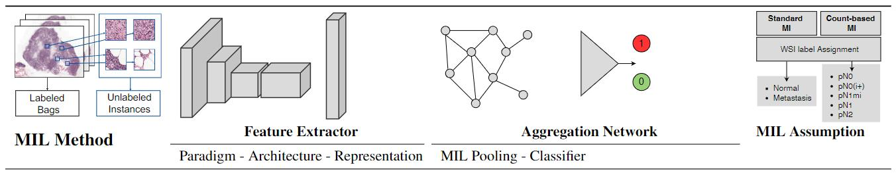

# With a Little Help from Pathologists: Assumption-aware Feature Extractor in Multi-instance Learning for Whole-slide Pathological Images
## Introduction
This repository provides the PyTorch implementation of the paper *With a Little Help from Pathologists: Assumption-aware Feature Extractor in Multi-instance Learning for Whole-slide Pathological Images*.

<p align="center">
   
</p>

## Installation

## Usage

### Prepare Dataset
#### NCTCRC
Download dataset from [NCTCRC](https://zenodo.org/record/1214456#.Yy2nHnZBxm8). We recommend setting the 
default data path as `./data/NCTCRC/`. After downloading, run `python3 ./tools/split_nctcrc.py` to split the val-test subsets. 
Finally, the folder structure looks like:
```bash
data/
  NCTCRC/
    NCT-CRC-HE-100K/
      ADI/
      ...
    CRC-VAL-HE-7K/
      ADI/
      ...
    VAL_TEST/
      val/
        ADI/
          ADI-TCGA-YSRKTMRF.tif
          ...
        ...
      test/
        ADI/
        ...
```
#### NCTCRC-BAGS
Based on NCTCRC datasets, generate NCTCRC-BAGS by:
```bash
python3 ./tools/gen_bag_dataset.py
```
The script would generates bag label files indicating the bag indices and labels of the bags.

### Launch Experiments
#### Pretrain Feature Extractor
To reproduce feature extractor pre-training, run:
```bash
python3 main.py --runner_type $pretrain_type --ddp
```
where $pretrain_type in [moco, mt, oracle] representing 
self-supervised pre-training, semi-supervised pre-training and supervised pre-training. By setting `--sample_file`, multiple instance learning pre-train could be done.

#### Bag Classification
To reproduce bag classification experiments on NCTCRC, run:
```bash
python3 main.py --runner_type assumption \
-b 4 -j 16 --gpu 0 -a resnet50 --lr 0.001 \
--aggregator $aggregator \
--load $pretrain_weights \
--pretrained_type $pretrain_type \
--log_dir $log_dir \
--train-subdir "NCT-CRC-HE-100K" \
--eval-subdir "VAL_TEST/val" \
--train_label_file "./data/samples/nctcrc_bags/BL{$bag_length}/target{$target}/train_ins_0.txt" \
--val_label_file "./data/samples/nctcrc_bags/BL{$bag_length}/target{$target}/val_ins_0.txt"\
--cn 2 \
"./data/NCTCRC/"
```
Set the above arguments according to the selected MIL aggregator, pretrained weights and positive bag target.

